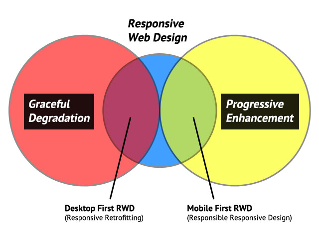

I like to stay on top of cutting edge web design and development practices. I have a few keyword searches on Twitter I like to check daily for new articles on this and that, though one trend that really has caught my attention recently is seeing more and more authors writing about techniques like mobile first, adaptive web design, and RESS and many others terms with what seems to be a misconception of these terms. From [articles talking about mobile first][1] with no mention of Luke Wroblewski to [articles explaining adaptive web design as RESS][2].

By no means I am all knowing of this terminology either, though I thought I could help clear some confusion by sharing insight to the origins of where some of these new terms came from. My hope in this, is that it will result in more accurate articles which, would ideally, result in a better understanding of these techniques for a wider range of readers. With this, maybe we can reduce discussions where we are talking past each other instead of with each other because of a simple misunderstanding of terminology. The words we use to describe what we do have a way of evolving and gaining additional meaning over time, so I don’t mean to cement these definitions. This is happening with responsive web design and is happening with [mobile-first][3] as Brad Frost documented. As I talk about these terms, these are the meanings I've come to know and wanted to share in hopes of clearing up some confusion.

## Progressive Enhancement

Progressive enhancement is a strategy for [web design][4] that emphasizes accessibility, [semantic HTML markup][5], and external style sheet and scripting technologies. Progressive enhancement uses web technologies in a layered fashion that allows everyone to access the basic content and functionality of a web page, using any browser or internet connection, while also providing an enhanced version of the page to those with more advanced browser software or greater bandwidth.

(Source: [Wikipedia][6])

Progressive enhancement was coined by [Steven Champeon][7] back in 2003. It allows us to start with a core experience and layer on enhancements as the browser is found more capable. A lot of today’s best practices fall under progressive enhancement, see: mobile first responsive web design, feature detection, conditional loading.

**Additional Resources:**

- [Progressive Enhancement and the Future of Web Design][7]
- [Inclusive Web Design Future][8]
- [Progressive Enhancement][6]
- [Test-Driven Progressive Enhancement][9]
- [Understanding Progressive Enhancement][10]
- [Behavioral Separation][11]

## Graceful Degradation

Graceful degradation comes from the concept in software development of [fault tolerance][12]. With graceful degradation, designers would create Web pages for the latest browsers that would also work well in older versions of browser software. Graceful degradation was supposed to allow the page to &#8220;degrade&#8221;, or remain presentable even if certain technologies assumed by the design were not present, without being jarring to the user of such older software.

(Source: [Wikipedia][6])

**Additional Resources:**

- [Progressive Enhancement and Graceful Degradation: an Overview][14]
- [Graceful Degredation versus Progressive Enhancement][15]

## Responsive Web Design

Coined by [Ethan Marcotte][16] in May 2010, is a technique for adapting a website's layout across multiple devices. The technique is composed of 3 elements.

**Media Queries**

[Media queries][17] allow the page to use different CSS style rules based on characteristics of the device the site is being displayed on, most commonly the width of the [browser][18].

**Fluid Grids**

The fluid [grid][19] concept calls for page element sizing to be in relative units like percentages or [EMs][20], rather than absolute units like [pixels][21] or [points][22].

**Flexible Images**

Flexible images are also sized in relative units (up to 100%), so as to prevent them from displaying outside their containing [element][23].

(Source: [Wikipedia][24])

Marcotte published a book entitled [Responsive Web Design][25]. Responsive Web Design is sometimes referred to as [Responsive Design][26].

**Additional Resources:**

- [Responsive Web Design][16]
- [Responsive Web Design Book][25]
- [Mediaqueri.es][27]
- [What the heck is Responsive Web Design?][28]

## Mobile-First

Coined by [Luke Wroblewski][29] back in November 2009, is a mindset that allows new opportunities in web design and development by switching our focus from desktop-first. Wroblewski published a book entitled Mobile First which covers different concepts of a mobile-first mindset.

1. Mobile is exploding
2. Mobile forces us to focus
3. Mobile extends your capabilities

**Additional Resources:**

- [Mobile First Book][30]
- [Mobile First: What Does It Mean?][31]
- [Rethinking Your Mobile First Strategy][32]

## Mobile-First Responsive Web Design

This term combines the mobile-first mindset from Wroblewski with Marcotte’s Responsive Web Design technique. It involves starting with a baseline experience and using min-width media queries along with other elements of responsive web design to enhance the experience as the layout becomes wider. This approach falls in line with principles of progressive enhancement. While the technique of responsive web design can be implemented with a desktop-first or mobile-first approach, the mobile first is considered best practice amongst developers as it allows for more optimization for performance. Other terms you’ll often see when reading about mobile first responsive web design:

- Responsible Responsive Web Design
- Responsive Enhancement
- Feature Detection
- Conditional Loading

**Additional Resources:**

- [Mobile First Responsive Web Design][33]
- [Creating A Mobile-First Responsive Web Design][34]
- [FITC Mobile First Responsive Design][35]
- [Jason Grigsby – Mobile-First Responsive Design][36]
- [Mobile-First, Responsive Design Websites: Does This Really Matter?][37]

## Desktop-First

Desktop-first is the flip side to mobile-first. It has been the mindset of web designers and developers for the last 15+ years.

Desktop-First Responsive Web Design This approach to responsive web design lines up with principles of graceful degradation. You start with your desktop site and add max-width media queries along with other elements of responsive web design to your site. Another term I've seen associated with this approach is [Responsive Retrofitting][38]

**Additional Resources:**

- [Retrofitting sites with responsive design with Ben Callahan][39]
- [Give the Web a Responsive-Design Facelift With ‘Responsive Retrofitting’][40]
- [Responsive Retrofitting from CSS Dev Conf 2012 in Honolulu, HI][41]

## Adaptive Web Design

This is the term I see the most confusion with. The concept of adaptive web design has been around for sometime, though
[Aaron Gustafson][42] really popularized the term with his book, [Adaptive Web Design Crafting Rich Experiences with Progressive Enhancement][42]. I could try to explain what adaptive web design means, though I’d rather just pull a quote from Gustafson himself from a recent [Breaking Development][43] interview.

> &#8230;adaptive web design, the term that I, you know, decided to use for the title of the book, was mainly trying to come up with a phrase that kind of encapsulated what progressive enhancement was all about. Progressive enhancement as a term, you know, it’s been with us since about 2003, but it also feels very clinical and sounds kind of boring. And from a marketing perspective with the book we wanted to make sure that we weren't, you know, creating confusion with the Filament Group’s book, “Designing with Progressive Enhancement,” which is a fantastic book and I certainly recommend people purchase that as well. But we wanted to kind of disambiguate my book from that book. So, we were trying to think of, you know, what exactly does all of this stuff really mean, and it was about creating rich, adaptable experiences that tailor themselves to the particular device that you were working with. So, the way that I view progressive enhancement is very much analogous to adaptive web >design. It’s essentially the same concept.

From this, I get the idea that adaptive web design and progressive enhancement are interchangeable, where adaptive web design may just be a more modern take on progressive enhancement, used for what it sounds like marketing reasons. This is a term that I believe will continue to be ambiguous and have it’s meaning morphed as needed.

**Additional Resources**

- [On Adaptive vs. Responsive Web Design][44]
- [What is Responsive and Adaptive Web Design?][45]
- [Adaptive vs. Responsive, What’s the Difference?][46]

## Adaptive Layouts

The concept of [adaptive layouts][47] is often confused with term adaptive web design. Where responsive web design implements fluid states between breakpoints, adaptive layouts implements fixed states between breakpoints. This is usually achieved by setting either a set width, or max-width in certain breakpoints. I think the best way to understand this technique is to see it in action.

**Examples of Adaptive Layouts**

- [Sony.com][48]
- [FoodSense.is][49]
- [LondonandPartners.com][50]
- [SasquatchFestival.com][51]
- [InformationArchitects.net][52]

**Examples of Responsive Web Design**

- [BostonGlobe.com][53]
- [Microsoft.com][54]
- [TheGreatDiscontent.com][55]
- [StephenCaver.com][56]
- [Starbucks.com][57]

## RESS

RESS is another term I often see confused with adaptive web design. Original coined by [Luke Wroblewski][58] in September 2011, it stands for Responsive Design + server-side Components. “In a nutshell, RESS combines adaptive layouts with server-side component (not full page) optimization. So a single set of page templates define an entire site for all devices but key components within that site have device-class specific implementations that are rendered server side.”

(Source: [Luke Wroblewski][58])

For some time, the server-side component in RESS was assumed to be a device detection solution like WURFL, Categorizr, Device Atlas. Recently though, I had an insightful conversation with Tim Murtaugh. Tim helped develop the redesign for [An Event Apart][59]. In an [article about the redesign][60], it was mentioned that RESS was used in the redesign. I was curious about which server-side component they were using as part of their RESS implementation, however when talking to Tim, he mentioned they were conditionally loading resources based on feature detection. Which is perfectly reasonable and the approach I prefer when I’m build responsive sites. Though the use of the term RESS did not seem to line up with my understanding of it. An [interesting discussion][61] ensued on Twitter between, Tim Murtaugh, Luke Wroblewski, Ethan Marcotte, Scott Jehl and myself about what RESS actually is. After the discussion I don’t think I understand what RESS full encapsulates. Depending on [who you ask][62], conditionally loading resources/markup via Ajax based on feature detection could be defined as RESS, where the server-side component is the part the returns the data for the Ajax call, though I believe most people still associate RESS with responsive design + a server-side device detection component. I think this is a perfect example of where terms we use everyday have a way of evolving as we adapt with change over time.

## In Conclusion

Hopefully this can serve as a reference for those who want to catch up on these new terms. It’s always good when you’re planning out your next site project to make sure all of those involved are on the same page. By defining these terms for those who may not be familiar with them helps ensure better understanding for everyone throughout the project.

[1]: http://www.businessinsider.com/survey-mobile-first-bad-strategy-2012-12
[2]: http://uxmag.com/articles/combining-responsive-and-adaptive-strategies-to-solve-mobile-design-challenges
[3]: http://bradfrostweb.com/blog/mobile/the-many-faces-of-mobile-first/
[4]: http://en.wikipedia.org/wiki/Web_design
[5]: http://en.wikipedia.org/wiki/Semantic_HTML
[6]: http://en.wikipedia.org/wiki/Progressive_enhancement
[7]: http://www.hesketh.com/thought-leadership/our-publications/progressive-enhancement-and-future-web-design
[8]: http://hesketh.com/thought-leadership/our-publications/inclusive-web-design-future
[9]: http://alistapart.com/article/testdriven
[10]: http://alistapart.com/article/understandingprogressiveenhancement
[11]: http://alistapart.com/article/behavioralseparation
[12]: http://en.wikipedia.org/wiki/Graceful_degradation
[13]: http://andreasviklund.com/learn/graceful-degradation-vs-progressive-enhancement-part-1/
[14]: http://www.sitepoint.com/progressive-enhancement-graceful-degradation-basics/
[15]: http://www.w3.org/wiki/Graceful_degredation_versus_progressive_enhancement
[16]: http://alistapart.com/article/responsive-web-design
[17]: http://en.wikipedia.org/wiki/Media_queries
[18]: http://en.wikipedia.org/wiki/Web_browser
[19]: http://en.wikipedia.org/wiki/Grid_%28page_layout%29#Grid_use_in_web_design
[20]: http://en.wikipedia.org/wiki/Em_%28typography%29
[21]: http://en.wikipedia.org/wiki/Pixel
[22]: http://en.wikipedia.org/wiki/Point_%28typography%29
[23]: http://en.wikipedia.org/wiki/HTML_element
[24]: http://en.wikipedia.org/wiki/Responsive_web_design
[25]: http://www.abookapart.com/products/responsive-web-design
[26]: http://www.google.com/trends/explore#q=responsive%20design,%20responsive%20web%20design&cmpt=q
[27]: http://mediaqueri.es/
[28]: http://johnpolacek.github.com/scrolldeck.js/decks/responsive/
[29]: http://www.lukew.com/ff/entry.asp?933
[30]: http://www.abookapart.com/products/mobile-first
[31]: http://www.uxmatters.com/mt/archives/2012/03/mobile-first-what-does-it-mean.php
[32]: http://vincentjordan.com/2012/02/rethinking-your-mobile-first-strategy/
[33]: http://bradfrostweb.com/blog/web/mobile-first-responsive-web-design/
[34]: http://www.html5rocks.com/en/mobile/responsivedesign/
[35]: http://www.slideshare.net/grigs/fitc-mobile-first-responsive-design
[36]: http://www.uie.com/brainsparks/2012/10/12/jason-grigsby-mobile-first-responsive-design/
[37]: http://435digital.com/blog/2012/10/16/mobile-first-responsive-design-websites/
[38]: https://github.com/sparkbox/Responsive-Retrofitting
[39]: http://responsivedesignweekly.com/rwd-summit/retrofitting-sites-with-responsive-design-with-ben-callahan/
[40]: http://www.webmonkey.com/2012/09/give-the-web-a-responsive-design-facelift-with-responsive-retrofitting/
[41]: https://speakerdeck.com/bencallahan/responsive-retrofitting-from-css-dev-conf-2012-in-honolulu-hi
[42]: http://easy-readers.net/books/adaptive-web-design/
[43]: https://bdconf.com/podcasts/adaptive-web-design-with-aaron-gustafson/
[44]: http://blog.easy-designs.net/archives/2011/11/16/on-adaptive-vs-responsive-web-design/
[45]: http://www.ampagency.com/what-is-responsive-and-adaptive-web-design/
[46]: http://viljamis.com/blog/2012/adaptive-vs-responsive-whats-the-difference.php
[47]: https://twitter.com/stephanierieger/status/237936382595723264
[48]: http://www.sony.com/index.php
[49]: http://foodsense.is/
[50]: http://www.londonandpartners.com/
[51]: http://sasquatchfestival.com/
[52]: http://informationarchitects.net/
[53]: http://bostonglobe.com/
[54]: http://www.microsoft.com/en-us/default.aspx
[55]: http://thegreatdiscontent.com/
[56]: http://stephencaver.com/
[57]: http://www.starbucks.com/
[58]: http://www.lukew.com/ff/entry.asp?1392
[59]: http://aneventapart.com/
[60]: http://aneventapart.com/news/post/aea-2012-relaunch
[61]: https://twitter.com/bjankord/status/275672328153755649
[62]: https://twitter.com/lukew/status/275678033661272064
